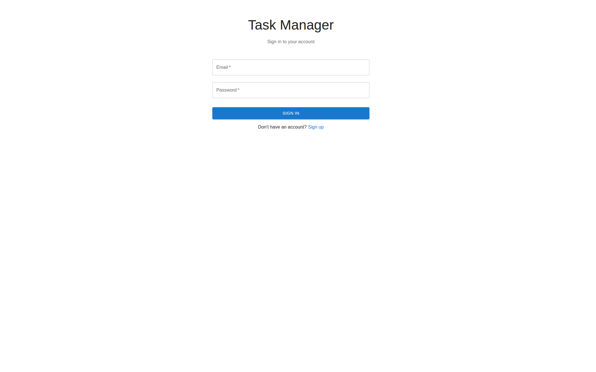
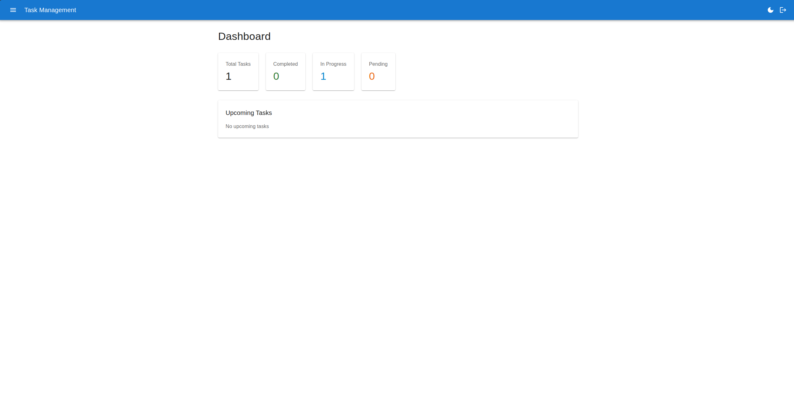
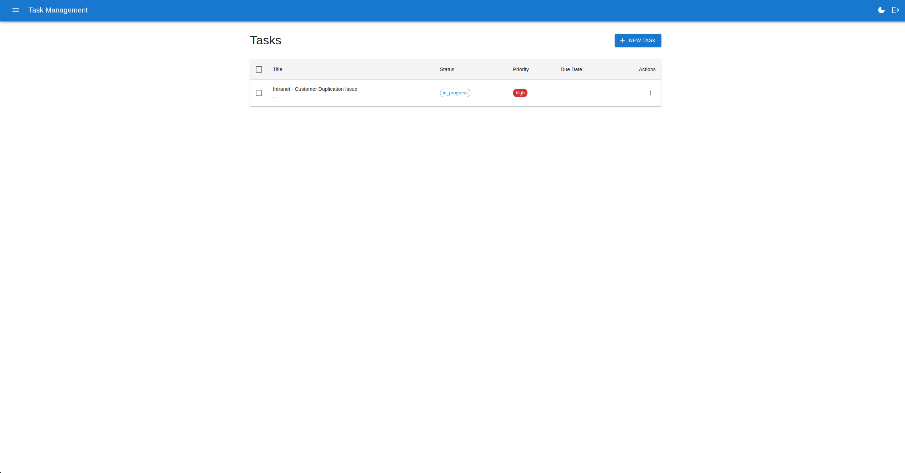

# Task Management Dashboard

<div align="center">
  
</div>

## Features

- ✅ User Authentication (JWT)
- ✅ Create, Read, Update, Delete Tasks
- ✅ Task Status Management
- ✅ Priority & Due Date Tracking
- ✅ Task Statistics Dashboard
- ✅ Upcoming Tasks View
- ✅ Advanced Filtering & Search
- ✅ Dark Mode Support
- ✅ Responsive Design
- ✅ Real-time Data Caching

## Tech Stack

- **React 18** - UI Library
- **Redux Toolkit** - State Management
- **React Query** - Server State Management
- **Material-UI (MUI)** - Component Library
- **Axios** - HTTP Client
- **React Router** - Navigation
- **Vite** - Build Tool

## Quick Start

```bash
# Install dependencies
npm install

# Set environment variables
cp .env.example .env

# Start development server
npm run dev

# Build for production
npm run build
```

## Environment Variables

```env
REACT_APP_API_URL=http://localhost:8000/api
REACT_APP_ENVIRONMENT=development
```

## API Endpoints

- `POST /api/auth/login` - User Login
- `POST /api/auth/register` - User Registration
- `GET /api/tasks` - Get All Tasks
- `POST /api/tasks` - Create Task
- `PUT /api/tasks/:id` - Update Task
- `DELETE /api/tasks/:id` - Delete Task
- `PATCH /api/tasks/:id/status` - Change Status
- `GET /api/tasks/statistics` - Task Statistics
- `GET /api/tasks/upcoming` - Upcoming Tasks

## Project Structure

```
src/
├── api/              # Axios client & config
├── hooks/            # Custom React Query hooks
├── store/            # Redux slices
├── components/       # React components
├── pages/            # Page components
├── utils/            # Helper functions
└── styles/           # Global styles
```

## Screenshots






## Author

**Syed Ziar Hussain Shah**  
LAMP Full Stack Developer @ CloudPSO  
📧 [ziar.shah.pk@gmail.com](mailto:ziar.shah.pk@gmail.com)